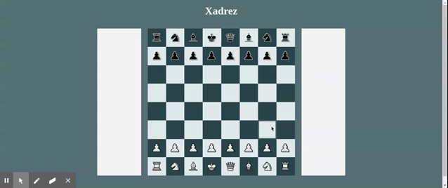
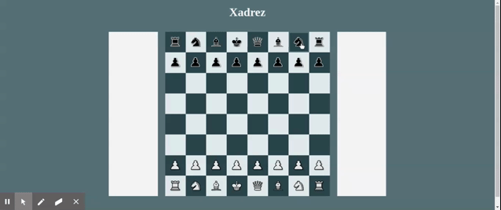
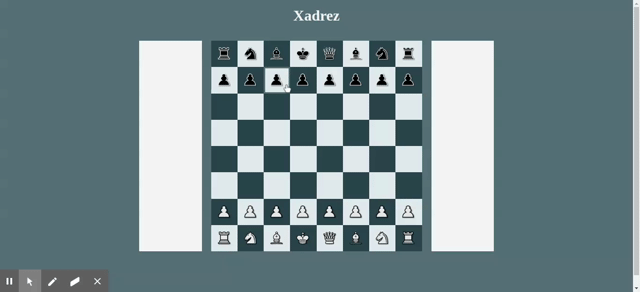

# XADREZ-JS

Desenvolvido com *JavaScript* puro, contendo interações com a DOM, funções construtoras, funções anônimas, arrow functions, herança de funções, promises, auxílio do *Gulp* para unificar os arquivos. Tem o intuito de exercitar conhecimentos em js, por isso não contém os movimentos Roque e a Promoção de Peças. 

## Movimentos

- Bispo

- Cavalo

- Torre

- Xeque / Rainha

- Xeque-Mate / Rainha

